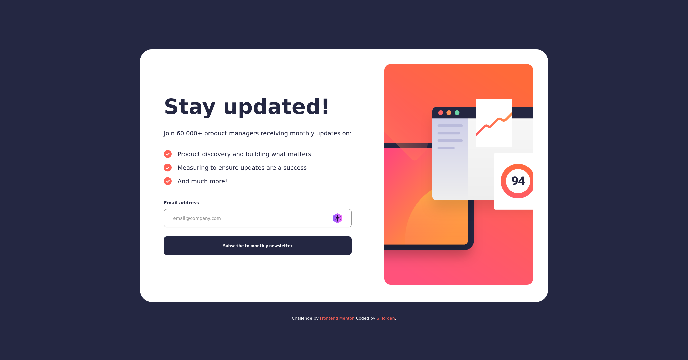
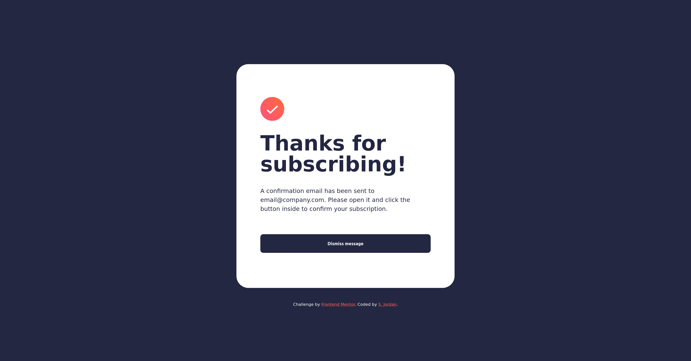

# Frontend Mentor - Newsletter sign-up form with success message solution

This is a solution to the [Newsletter sign-up form with success message challenge on Frontend Mentor](https://www.frontendmentor.io/challenges/newsletter-signup-form-with-success-message-3FC1AZbNrv). Frontend Mentor challenges help you improve your coding skills by building realistic projects. 

## Table of contents

- [Overview](#overview)
  - [The challenge](#the-challenge)
  - [Screenshot](#screenshot)
  - [Links](#links)
- [My process](#my-process)
  - [Built with](#built-with)
  - [What I learned](#what-i-learned)
  - [Useful resources](#useful-resources)
- [Author](#author)

## Overview

### The challenge

Users should be able to:

- Add their email and submit the form
- See a success message with their email after successfully submitting the form
- See form validation messages if:
  - The field is left empty
  - The email address is not formatted correctly
- View the optimal layout for the interface depending on their device's screen size
- See hover and focus states for all interactive elements on the page

### Screenshot

### Links

- Solution URL: [Solution on Frontend Mentor](https://www.frontendmentor.io/solutions/newsletter-sign-up-form-using-scss-DmxKEMeb-Y))
- Live Site URL: [GitHub Pages](https://curricle.github.io/Newsletter-Sign-up-Form/)

## My process

### Built with

- Semantic HTML5 markup
- Flexbox
- CSS Grid
- Mobile-first workflow
- SCSS

### What I learned

How built-in form validation works as well as external form validation, and how to customize validation rules and user feedback.

### Useful resources

- [Mozilla Documentation on Forms](https://developer.mozilla.org/en-US/docs/Learn_web_development/Extensions/Forms)

## Author

- Website - [Steph Jordan](https://jordanmakes.com)
- Frontend Mentor - [@curricle](https://www.frontendmentor.io/profile/curricle)
